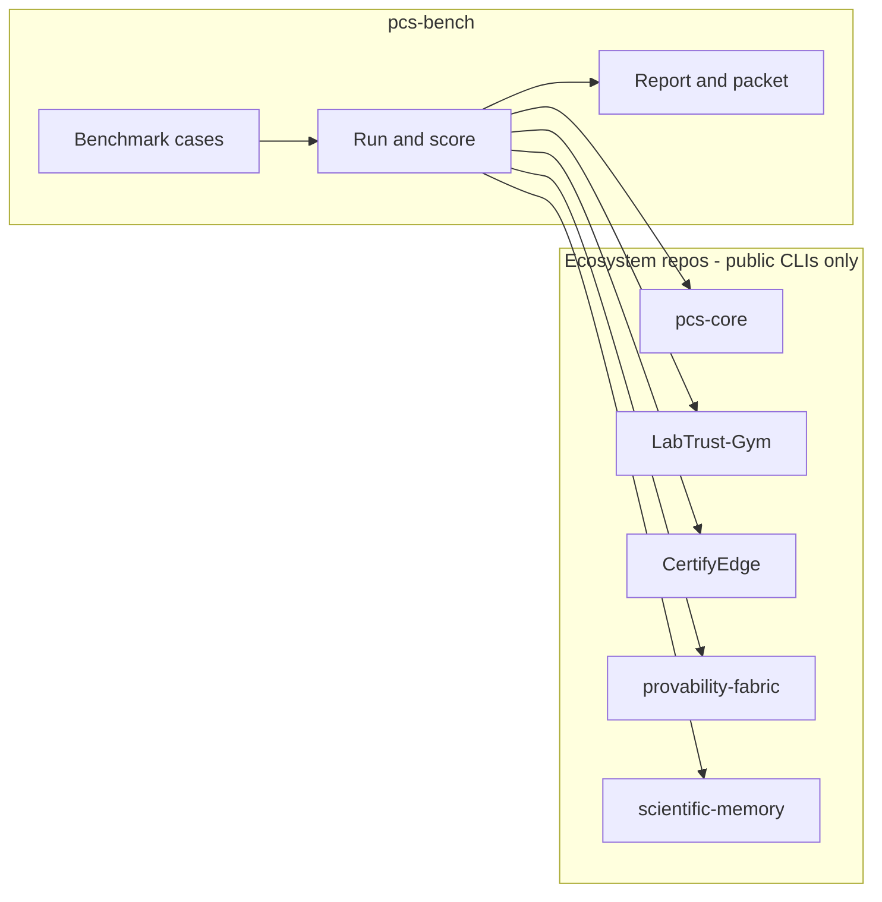

# pcs-bench

[](https://www.python.org/downloads/)
[](LICENSE)
[](https://github.com/SentinelOps-CI/pcs-core)

**Independent benchmarks for Proof-Carrying Science releases.**

pcs-bench runs realistic good-and-bad release scenarios, scores the results, and packages everything reviewers need while certificates, admission, and rendering stay in the ecosystem projects where they belong. Protocol rules live in [pcs-core](https://github.com/SentinelOps-CI/pcs-core), and this repository provides the evaluation harness that ties the ecosystem together.

---

## Why pcs-bench exists

Scientific releases should be **reproducible**, **auditable**, and **easy to explain**. pcs-bench answers a focused question about evidence.

> When we ship a PCS release, can we show with evidence that valid releases pass, invalid ones fail for the right reasons, and the story holds across tools?

The harness calls each project’s public command-line tools, records what happened, and compares outcomes to clear expectations so teams can defend a release with data instead of anecdote.

---

## What you get

| Output | Who uses it |
|--------|-------------|
| **Benchmark report** — machine-readable JSON aligned with pcs-core schemas | CI, release automation, regression tracking |
| **Human report** — Markdown or HTML summaries with scores and failures | Engineers and release owners |
| **Reviewer packet** — cases, fixtures, report, and reproduction checks in one folder | External review, audits, publications |
| **Readiness summary** — pass/fail checklist before a version tag | Release managers |

Eight benchmark dimensions cover reproducibility, failure localization, certificates, registry coverage, formal checks, scientific-memory rendering, repair hints, and cross-domain portability. Full metric definitions live in [Metrics](docs/metrics.md).

---

## Try it in five minutes

**Requirements:** Python 3.11 or 3.12.

```bash
git clone https://github.com/fraware/pcs-bench.git
cd pcs-bench
pip install -e ".[dev]"
python scripts/materialize_fixtures.py
make gate
```

That command runs the full offline pipeline, including fixtures, case checks, simulated benchmarks, report validation, and a reviewer packet, and it only requires this repository on disk.

On Windows, use `.\make.ps1 gate` instead of `make gate`. When the console script is absent from PATH, invoke `python -m pcs_bench` with the same arguments.

Generate a default config and run a single suite.

```bash
pcs-bench init
pcs-bench list-suites
pcs-bench run --suite labtrust-qc-release --out reports/try.json
```

---

## How it works



**Cases** describe a release scenario such as a valid chain, a tampered hash, or a missing artifact. **Run** executes the scenario against real tools in live mode or against checked-in expected outcomes in offline simulation. **Report** aggregates scores, exports a standard JSON report, and can build a packet for reviewers.

Every interaction stays on public command-line entry points, and the harness records a full audit trail for each step.

---

## Two ways to run

| Goal | What to run | What you need |
|------|-------------|---------------|
| **Develop or open a PR** | `make release-prep` | This repo only |
| **Cut a real PCS release** | `make live-ci` then `make release-verify` | Clones of pcs-core and the four producer repos (see below) |

**Offline simulation** is the default mode because it is fast, deterministic, and well suited to contributors and continuous integration.

**Live evaluation** invokes real binaries from LabTrust-Gym, CertifyEdge, provability-fabric, and scientific-memory, and release managers rely on that path for release-grade evidence before a tag.

The [Release guide](docs/release.md) walks through tagging, and [Running benchmarks](docs/execution.md) lists day-to-day commands.

---

## Benchmark suites

| Suite | What it exercises |
|-------|-------------------|
| LabTrust QC release | End-to-end QC release chain and where failures are caught |
| Tool use safety | Certificates, policy, and unauthorized tool calls |
| Computation reproducibility | Witnesses, environment digests, and result integrity |
| Formal trust kernel | Lean obligations and theorem checks |
| Scientific memory rendering | Whether evidence renders with the required sections |
| Cross-domain | Shared PCS protocol behavior across workflows |

```bash
pcs-bench run --suite all --simulate --out reports/full.json
```

Suite layout and methodology appear in [docs/benchmark-methodology.md](docs/benchmark-methodology.md).

---

## Ecosystem

pcs-bench sits beside the projects it measures and coordinates them through documented interfaces.

| Project | Role in evaluation |
|---------|-------------------|
| [pcs-core](https://github.com/SentinelOps-CI/pcs-core) | Schemas, registry, conformance |
| [LabTrust-Gym](https://github.com/fraware/LabTrust-Gym) | Reference workflow and release scenarios |
| [CertifyEdge](https://github.com/fraware/CertifyEdge) | Certificates and witnesses |
| [provability-fabric](https://github.com/SentinelOps-CI/provability-fabric) | Admission and verification |
| [scientific-memory](https://github.com/fraware/scientific-memory) | Evidence import and rendering |
| **pcs-bench** (here) | Orchestration, scoring, packets, release checks |

Producer repositories publish a standard ingest file (`pcs_bench_ingest.v0.json`) that pcs-bench merges into a single ecosystem-wide report. The [Producer integration](docs/producers.md) guide explains that contract.

---

## Contribute

We welcome issues, documentation improvements, new benchmark cases, and CI hardening, and you can make meaningful contributions with only this repository cloned locally.

**Good first steps**

1. Run `make release-prep` and confirm it passes.
2. Read [CONTRIBUTING.md](CONTRIBUTING.md) and [Adding a benchmark suite](docs/adding-a-benchmark-suite.md).
3. Pick a suite under `benchmarks/`, add or refine a case with `benchmark_case.v0.json` and `expected/verification_result.json`.
4. Open a pull request so offline CI runs automatically.

**Ways to help**

- Add invalid-release scenarios that reflect real failure modes in the field
- Improve reports and packet layout for reviewers
- Extend live-adapter coverage when a producer CLI stabilizes
- Clarify documentation wherever readers might stall

Open a [GitHub issue](https://github.com/fraware/pcs-bench/issues) for questions and design discussion.

---

## Documentation

| Topic | Link |
|-------|------|
| Full doc index | [docs/README.md](docs/README.md) |
| Configuration (`pcs-bench.yaml`) | [docs/configuration.md](docs/configuration.md) |
| All CLI commands | `pcs-bench --help` |

---

## License

Apache-2.0. See [LICENSE](LICENSE).
